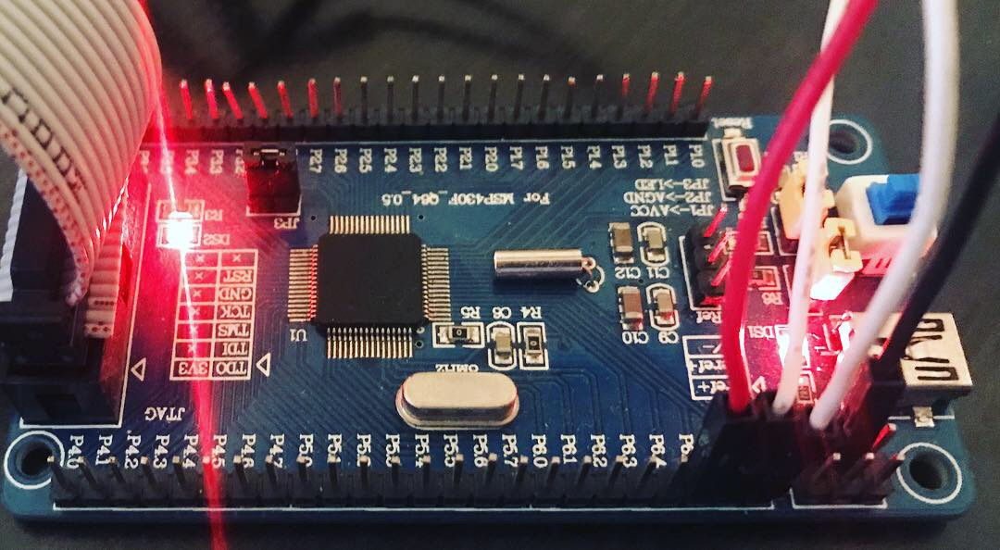

# MSP430F169
Repositorio Dedicado a la Programacion del Microcontrolador MSP430F169 de Texas Instruments.

### Video Tutoriales
Desarrollo completo en Youtube: https://www.youtube.com/c/LaloAlvarez

### Descipcion de Proyectos.
|Nombre del Proyecto|Perifericos|Description|
|-------------------|-----------|-----------|
|HelloWorld         |GPIO       | Prender y apgar un LED|
|GPIO               |GPIO, CPU, LPM|Utilizacion de LED y SWITCHES|
|GPIO_ClockSelection|GPIO, CPU, Interrupciones, BCM| Configuracion del reloj de forma dinamica|
|GPIO_Interrupt     |GPIO, CPU, Interrupciones|Utilizacion del Periferico GPIO utilizando Interrupciones|

### Definiciones
MSP 
: Mixed-Signal Processor

MSP430
: Familia especifica de Texas Instruments

GPIO
: General-Porpuse Input/Output

RISC
: Reduced Instruction Set Computing

BCM
: Basic Clock Module

LPM
: Low-Power Mode

### Tarjeta de Desarrillo Utilizada

### Documentos de interes
